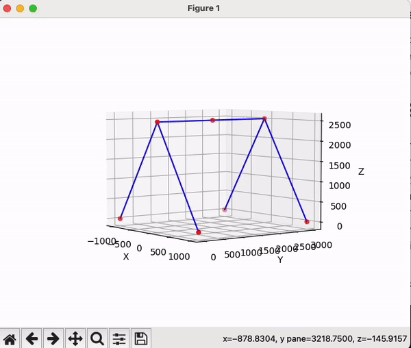
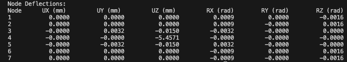
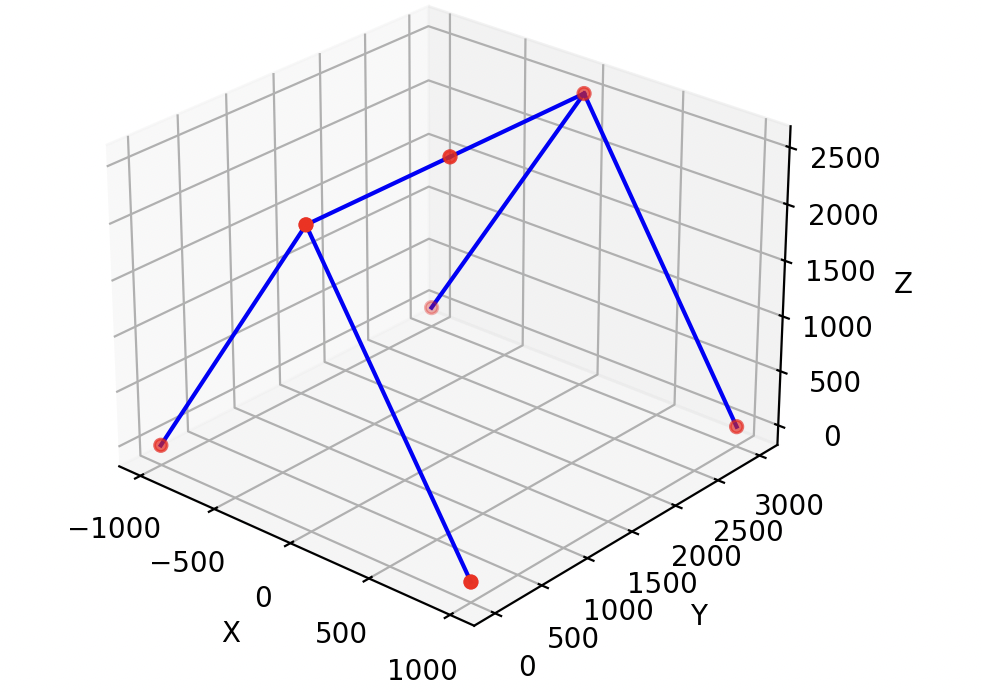

# Matrix Structural Analysis Project

<h4 style="margin-top: -20px;">(Python Version)</h4>

This repository contains a Python implementation of a matrix structural analysis for a 3D truss structure. The project includes the ability to calculate node displacements, reaction forces, and element forces for a given structure based on user-defined inputs.

<div align="center">
    
</div>

## Project Structure

- **main.py**: The main entry point for the program. It contains the core logic to set up and solve the structural analysis.
- **swingset.py**: A script that executes the analysis and handles output formatting and debugging.
- **plot.py**: Contains the function for plotting the 3D structure based on node coordinates and element connectivity.
- **analysis.py**: Contains helper functions for calculating element stiffness matrices and transformation matrices.

## Features

- Calculate nodal displacements under given loads.
- Compute reaction forces at fixed supports.
- Determine internal forces in each element.
- Plot the 3D structure for visual analysis.

## Requirements

- Python 3.x
- NumPy
- Matplotlib

You can install the required packages using the following command:

```bash
pip install numpy matplotlib
```

## Usage

1. **Running the Analysis**:

   - Ensure that the necessary files (`main.py`, `swingset.py`, `plot.py`, `analysis.py`) are in the same directory.
   - Run the main script to execute the analysis and view the results:
     ```bash
     python main.py
     ```

2. **Debugging**:

   - The script outputs detailed variables and matrices used in the analysis. If additional debugging information is needed, you can enable more print statements in `swingset.py` or add to the `debug.py` file.

3. **Plotting**:
   - The structure can be visualized by running the plot function in `plot.py`. The structure is plotted in 3D using Matplotlib, with nodes and elements clearly indicated.

## Screenshots

### Screenshot 1: Node Deflections Output



<div style="text-align: right; margin-right: 25px">
   (An example output of deflections)
</div>

### Screenshot 2: 3D Structure Plot



<div style="text-align: right; margin-right: 45px">
   (Plot of the structure)
</div>

## How It Works

1. **Input Setup**:

   - Define the number of nodes (`nnodes`) and elements (`nele`).
   - Set up node coordinates and element connectivity (`coord` and `ends`).
   - Specify external forces and fixity conditions.

2. **Matrix Assembly**:

   - Local stiffness matrices are computed for each element using the `estiff` function from `analysis.py`.
   - Transformation matrices are calculated to account for the orientation of each element using the `etran` function.
   - Global stiffness matrix is assembled by aggregating local matrices.

3. **Solving**:

   - The global stiffness matrix is partitioned into free and fixed degrees of freedom.
   - The displacement vector for free nodes is solved using linear algebra.
   - Reaction forces and internal element forces are calculated.

4. **Output**:
   - The script outputs node displacements and reaction forces.
   - The structure is visualized using Matplotlib.

## Future Enhancements

- **Web Application**: Plan to develop a web app that allows users to interactively plot structures and input material properties.
- **Additional Debugging**: Incorporate a more robust debugging mechanism, potentially via a `debug.py` file to hold additional variable outputs.
